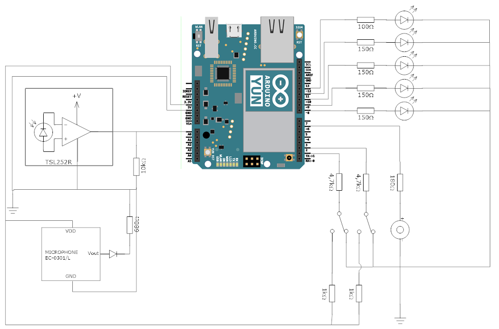

# Multimedia Delay Meter
This project provides code for a multimedia delay measurement device based on Arduino Yún Rev 2. 

The MM-delay meter generates light pulses and audio signals using an LED and a simple speaker. The received signals are captured by a light-to-voltage sensor and a microphone.

## Features

When a generated light or audio signal is captured and recognized at the other end of a multimedia system, the signal delay through the system is measured with ms accuracy.
The device allows two different media types: audio mode or video mode.

The series of measurements are stored in logs in an SD card, where each log contains a measurement series with timestamps and mediatype.
These logs are uploaded to [UNINETT multimedia delay database](http://delay.uninett.no) when the device is connected to WiFi.

The device connects automatically to a known available wireless network. When connected, it automatically uploads any logs that were saved when a WiFi was unavailable. It periodically checks its own WiFi status, and decides whether to reconnect and/or try to upload files based on the current status.

## Getting started
#### Requirements
- Arduino Yún Rev 2
- Micro SD card
- Circuit: 

## What's next?
- [ ] Delete old logs when SD card is full
